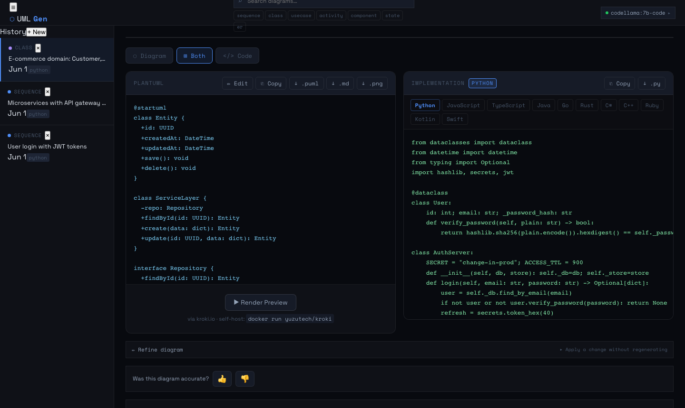

# UMLGen

Describe a system in plain English, get a PlantUML diagram and working implementation code back. No account, no cloud dependency, runs entirely on your machine.



---

## What it does

You type something like "User login flow with JWT and refresh tokens" — pick a diagram type and language — and UMLGen gives you:

1. Valid PlantUML code for the diagram
2. A working implementation in Python, Go, TypeScript, or 8 other languages
3. An SVG/PNG preview via Kroki

It uses RAG under the hood: before calling the LLM, it retrieves the most relevant UML syntax rules and examples from a local ChromaDB vector store. This cuts down on hallucinated syntax significantly.

**Supported diagram types:** sequence, class, use case, activity, component, state, ER

**Supported languages:** Python, JavaScript, TypeScript, Java, Go, Rust, C#, C++, Ruby, Kotlin, Swift

---

## Getting started

### Without Docker

**Backend**

```bash
cd backend
python3.12 -m venv .venv && source .venv/bin/activate
pip install -r requirements.txt
python -m scripts.ingest        # one-time setup, builds the vector DB
cp .env.example .env            # then edit .env to set your LLM backend
uvicorn api.main:app --reload --port 8000
```

**Frontend**

```bash
cd frontend
npm install
REACT_APP_API_URL=http://localhost:8000 npm start
```

Open http://localhost:3000.

### With Docker

```bash
docker compose up --build
```

First run pulls `codellama:7b-code` (~4 GB). After that it's instant.

| | URL |
|--|--|
| App | http://localhost:3000 |
| API | http://localhost:8000 |
| Docs | http://localhost:8000/api/docs |

---

## LLM backends

Set `LLM_BACKEND` in `backend/.env`:

| `LLM_BACKEND` | Setup |
|---|---|
| `gemini` | Free key at [aistudio.google.com/apikey](https://aistudio.google.com/apikey), set `GEMINI_API_KEY` |
| `ollama` | `ollama pull codellama:7b-code` |
| `openai_compat` | Any OpenAI-compatible server (LM Studio, vLLM, llama.cpp) |
| `transformers` | HuggingFace model loaded in-process, needs 16 GB+ RAM |
| `mock` | Returns fake diagrams — useful for UI development |

Gemini is the easiest to get started with. Ollama is best if you want everything local.

---

## Configuration

Copy `backend/.env.example` to `backend/.env`. Key settings:

```env
LLM_BACKEND=gemini
GEMINI_API_KEY=your-key-here

# Disable auth for local single-user use (default)
REQUIRE_AUTH=false

# Kroki for rendering — use public or self-host via Docker
KROKI_URL=https://kroki.io
```

---

## Multi-user / auth

Auth is off by default. Set `REQUIRE_AUTH=true` to enable JWT-based login. When enabled, all API endpoints require a Bearer token. The auth routes live at `/api/auth/register`, `/api/auth/login`, `/api/auth/refresh`.

---

## How the RAG pipeline works

1. Your description is embedded with `all-MiniLM-L6-v2`
2. ChromaDB returns the top-k most similar chunks (UML syntax rules + examples)
3. Those chunks are injected into the prompt before the LLM call
4. The LLM output is validated — if `@startuml`/`@enduml` aren't present, it retries up to 3 times with error feedback
5. If all retries fail, a simple stub is returned instead of an error

The knowledge base is built from `backend/scripts/ingest.py`. Add your own examples there and re-run `python -m scripts.ingest`.

---

## Running tests

```bash
cd backend
pytest
pytest --cov=. --cov-report=term-missing   # with coverage
```

Uses an in-memory SQLite DB and mock LLM — no external services needed.

---

## Stack

- **Frontend:** React 18
- **Backend:** FastAPI + SQLAlchemy (async) + aiosqlite
- **Vector DB:** ChromaDB + sentence-transformers
- **Rendering:** Kroki (self-hostable)
- **LLM:** pluggable — Gemini, Ollama, HuggingFace, or mock

---

## Contributing

See [CONTRIBUTING.md](CONTRIBUTING.md).

## License

[MIT](LICENSE)
